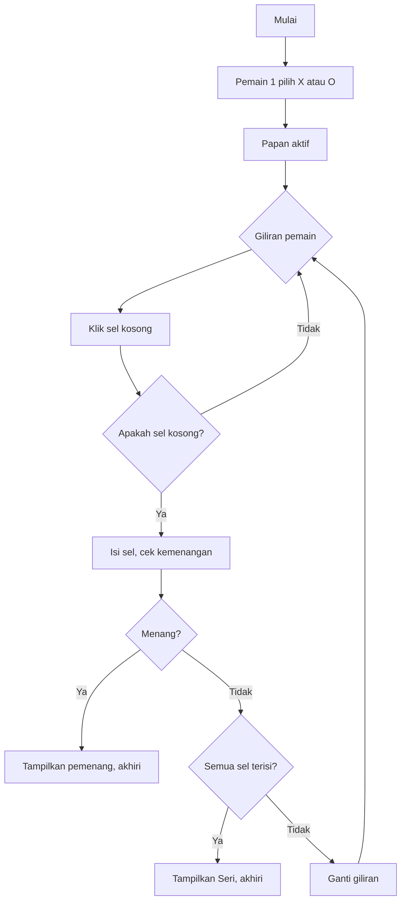
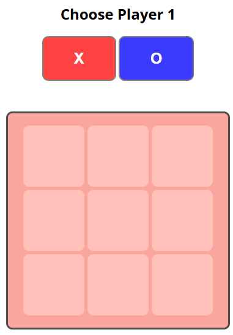
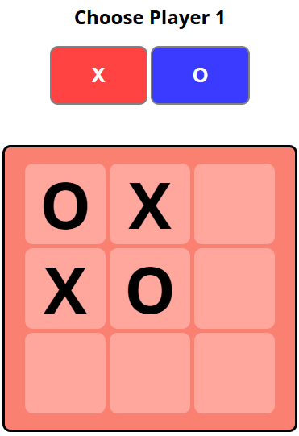
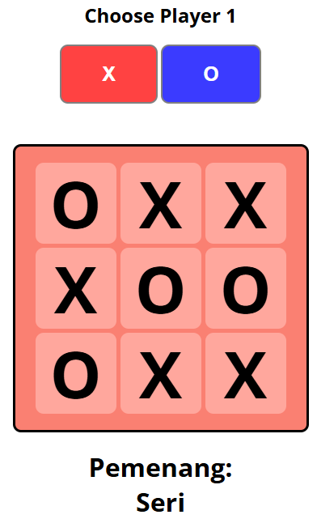

# 🎮 TicTacToe-Duel

Permainan **Tic-Tac-Toe** dua pemain lokal berbasis web, dibuat dengan HTML, CSS, dan JavaScript murni.  
Cocok untuk belajar DOM manipulation, logika permainan, dan dasar front-end.

---

## 📖 Daftar Isi
- [Fitur](#-fitur)
- [Cara Bermain](#-cara-bermain)
- [Alur Permainan](#-alur-permainan)
- [Struktur Proyek](#-struktur-proyek)
- [Penjelasan Kode](#-penjelasan-kode)
  - [HTML](#html)
  - [CSS](#css)
  - [JavaScript](#javascript)
- [Cara Kerja Fungsi Utama](#-cara-kerja-fungsi-utama)
- [🐞 Bug yang Diketahui & Solusi](#-bug-yang-diketahui--solusi)
- [📸 Pratinjau (Preview)](#-pratinjau-preview)
- [Cara Menjalankan](#-cara-menjalankan)
- [Teknologi](#-teknologi)
- [Lisensi](#-lisensi)

---

## ✨ Fitur

- 🔘 Pemain 1 dapat memilih simbol **X** atau **O**.
- 🧩 Papan interaktif 3×3 dengan efek visual.
- 🧠 Logika pengecekan pemenang:
  - Horizontal
  - Vertikal
  - Diagonal
- 🤝 Deteksi hasil **seri** jika papan penuh tanpa pemenang.
- 🔄 Tombol **Ulang** untuk memulai permainan baru.
- 🎨 Desain responsif sederhana.

---

## 🕹️ Cara Bermain

1. Buka file `index.html` di browser.
2. Pilih simbol untuk **Pemain 1** – `X` atau `O`.
3. Papan akan aktif. Pemain bergiliran mengklik sel kosong.
4. Pemain pertama yang membentuk garis lurus (horizontal, vertikal, diagonal) dengan simbolnya adalah **pemenang**.
5. Jika semua sel terisi tanpa pemenang, hasilnya **Seri**.
6. Klik tombol **Ulang?** untuk memulai permainan baru (halaman akan dimuat ulang).

---

## 🔁 Alur Permainan



---

## 📁 Struktur Proyek

```
TicTacToe-Duel/
├── index.html     # Struktur halaman dan elemen permainan
├── style.css      # Tampilan dan layout
└── script.js      # Logika permainan
```

---

## 🧠 Penjelasan Kode

### HTML
- **`div.select_player`** – Tempat pemain memilih simbol. Berisi dua tombol `onclick="choosePlayer('X')"` dan `onclick="choosePlayer('O')"`.
- **`div.board`** – Grid 3×3 dengan 9 `div.cell`, masing‑masing punya `id` unik (`1‑1` hingga `3‑3`). Setiap sel memanggil fungsi `move(id)` saat diklik.
- **`h1`** – Menampilkan teks pemenang atau “Seri”.
- **`button.ulang`** – Tombol untuk me‑*refresh* halaman.

### CSS
- **Layout** menggunakan `flexbox` untuk pusat, dan `grid` untuk papan.
- Papan awal **dinonaktifkan** dengan `pointer-events: none` dan `opacity: 0.7`; diaktifkan kembali oleh JavaScript saat pemain memilih simbol.
- Sel memiliki `cursor: pointer`, latar berubah saat *hover*, dan teks besar (80px) agar simbol mudah dibaca.
- Tombol pilihan `X` (merah) dan `O` (biru) memiliki efek `:active`.
- Tombol ulang (`class="ulang"`) awalnya `display: none`, muncul setelah permainan selesai.

### JavaScript
- **State awal**: `board` (array 2D) menyimpan simbol, `player` penentu giliran (ganjil = X, genap = O), `tekan` menghitung langkah, `players` menyimpan nama pemain.
- **`choosePlayer(p)`** – Menetapkan `player` dan `players`, lalu mengaktifkan papan.
- **`move(boardPlace)`** – Inti permainan:
  - Memecah ID sel (`1‑1`) menjadi indeks `[baris, kolom]`.
  - Jika sel kosong, isi dan cek kemenangan lewat `pemenang()`.
  - Jika terisi, batalkan langkah (kembalikan giliran).
  - Setiap langkah sukses menambah `player` dan `tekan`.
  - Jika `tekan == 10` (semua terisi tanpa pemenang) → seri.
- **`pemenang(PW)`** – Mengecek semua kemungkinan garis:
  - Horizontal & vertikal menggunakan loop, menghitung `winX` dan `winY`.
  - Diagonal: dua pengecekan langsung.
- **`champion(who)`** – Menonaktifkan klik, menampilkan pemenang/seri, memunculkan tombol ulang.
- **`ulang()`** – `location.reload()`.

---

## 🔧 Cara Kerja Fungsi Utama

### `move(boardPlace)`
```js
function move(boardPlace){
  square = document.getElementById(boardPlace);
  boardPlaceSplit = boardPlace.split('-').map(Number);

  if(player % 2 == 1){
    slash = 'X';
  } else {
    slash = 'O';
  }
  if (board[boardPlaceSplit[0]-1][boardPlaceSplit[1]-1] == ''){
    square.innerHTML = slash;
    board[boardPlaceSplit[0]-1][boardPlaceSplit[1]-1] = slash;
    kondisi = pemenang(slash);
    if(kondisi) champion(players[slash]);
  } else {
    player--;
    tekan--;
  }
  player++;
  tekan++;
  if(tekan == 10){
    champion("Seri")
  }
}
```
> **Masalah:** Setelah kemenangan di langkah ke‑9, `player++` dan `tekan++` tetap dijalankan, sehingga `tekan` menjadi 10 dan `champion("Seri")` menimpa teks pemenang.  
> **Solusi:** Hentikan fungsi setelah `champion()`, misalnya dengan `return`. Lihat bagian [Bug](#-bug-yang-diketahui--solusi).

### `pemenang(PW)`
Loop ganda untuk baris dan kolom, menghitung kemunculan berturut-turut. Jika `winX` atau `winY` mencapai 3 → `return true`. Diagonal diperiksa dengan kondisi langsung.

---

## 🐞 Bug yang Diketahui & Solusi

### 1. Seri menimpa kemenangan di langkah terakhir
**Penyebab:** Fungsi `move` tidak berhenti setelah mendeteksi kemenangan.  
**Solusi:** Tambahkan `return` setelah `champion(players[slash])` untuk menghentikan eksekusi sisa kode.

```js
if(kondisi) {
  champion(players[slash]);
  return; // <-- hentikan di sini
}
```
Atau pindahkan pengecekan `tekan == 10` ke dalam blok `else` atau setelah penempatan simbol, hanya jika tidak ada yang menang.

### 2. Variabel global tanpa deklarasi
Gunakan `let` atau `const` untuk menghindari kebocoran ke *global scope*.

### 3. Reset permainan dengan `location.reload()`
Kurang ideal; lebih baik reset state JavaScript tanpa memuat ulang halaman.

---

## 📸 Pratinjau (Preview)

  
*Pemain 1 memilih simbol X atau O.*

  
*Tampilan papan setelah beberapa langkah.*

  
*Notifikasi pemenang dan tombol Ulang muncul.*

> Tambahkan tangkapan layar nyata ke folder `screenshots/` dan perbarui path.

---

## 🚀 Cara Menjalankan

1. **Clone repositori:**
   ```bash
   git clone https://github.com/username/TicTacToe-Duel.git
   ```
2. Buka file `index.html` di browser modern (Chrome, Firefox, Edge).
3. Tidak perlu server – langsung jalan karena semuanya *client-side*.

---

## 🛠️ Teknologi

- HTML5
- CSS3 (Grid, Flexbox)
- JavaScript (ES6+)

---

## 📄 Lisensi

Proyek ini dilisensikan di bawah [MIT License](LICENSE).  
Silakan gunakan, modifikasi, dan sebarkan!
